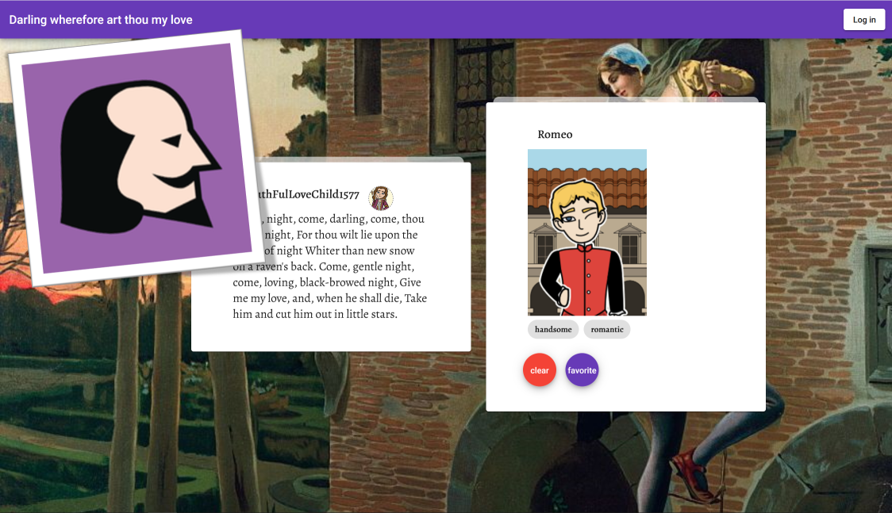
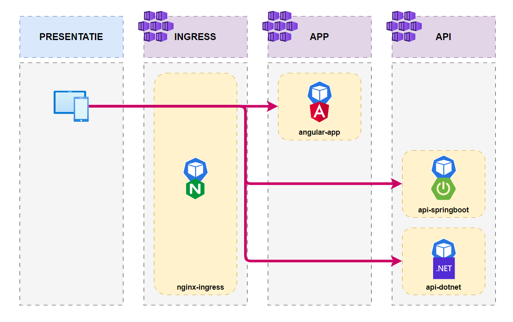
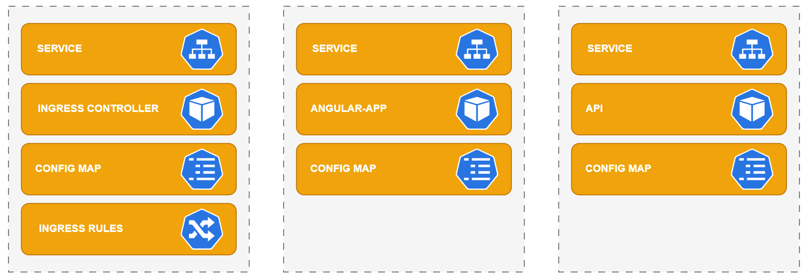

# Kubernetes-Foundation

Training materiaal voor de Kubernetes Foundation workshop. De content is ook beschikbaar in het Engels: [English / Engels](INTRO.md)

## Voorbereidingen workshop

Om deze workshop te kunnen volgen, moet je een aantal voorbereidingen treffen. Volg hiervoor de volgende stappen uit de [voorbereiding](workshop/nl/voorbereiding.md).
Deelnemers moeten deze stappen doen voor de workshop begint.

## Demo app
Onze demo app "Shakespearean Dating" bestaat uit een Angular 15 frontend en een .NET 7 of Spring Boot 3 API.

## Architectuur

In de workshop kan er gekozen worden voor een Spring Boot API of een .NET API (in deze afbeelding zijn ze beide opgenomen). De werking van beide API's is functioneel gelijk.

## Componenten

Tijdens de workshop zul je verschillende Kubernetes componenten uitrollen en zo kennismaken met Kubernetes Resources, YAML, de nodige CLI's en Helm Charts.

## Componenten

Tijdens de workshop zul je verschillende Kubernetes componenten uitrollen en zo kennismaken met Kubernetes Resources, YAML, de nodige CLI's en Helm Charts.

[Afbeelding volgt]

## Workshop introductie

Om te ondersteunen bij een korte introductie van de workshop is er een Microsoft PowerPoint slidedeck opgenomen.

[Presentatie volgt]

## Het Workshop script

Het script begeleidt de deelnemers bij de verschillende stappen van de workshop. Er zijn versies in het Nederlands en in het Engels.

[Scripts volgen]
